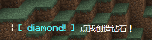
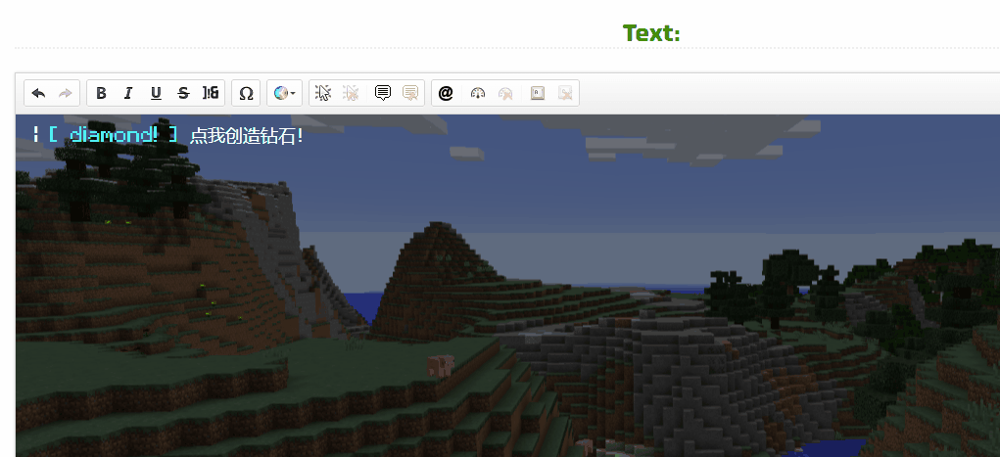
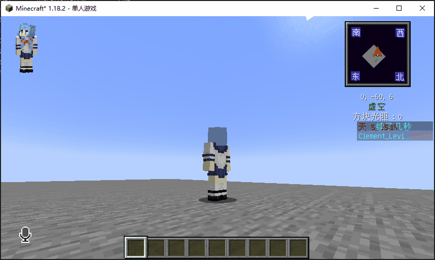
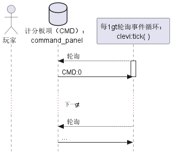
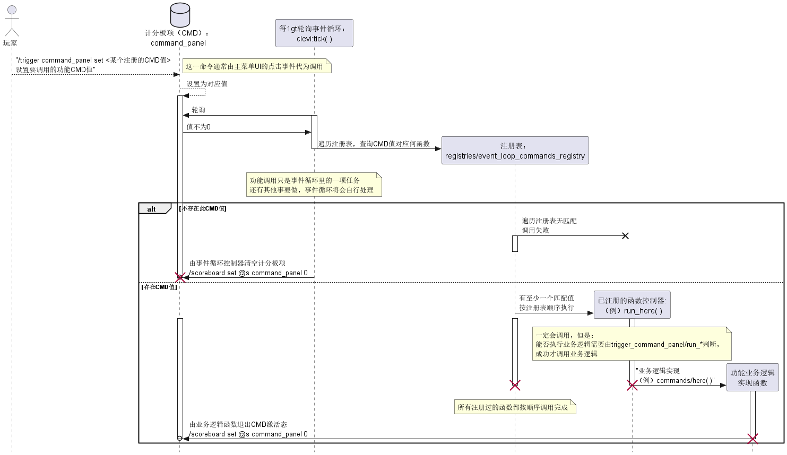

# Clement_Levi的原版生存指令系统

## 数据包介绍

### 作者信息

作者：[Clement_Levi](https://github.com/ClementLevi "GitHub")

联系方式：

* 邮箱：clement_levi@qq.com
* QQ交流群：152794569
* 主页：https://github.com/ClementLevi
* 项目地址：https://github.com/ClementLevi/CLevi-s-Functions-Menu

### 简介

本数据包基于便利MC原版生存体验的原则制作，主要针对单人及多人游戏内的[合成表]( "已独立为CLevi's Recipe数据包")、函数进行了修改，所有功能都可以按需开放给无权限普通玩家。

欢迎交流学习、自行魔改。本数据包基于[CC-BY-NC-SA 4.0](https://creativecommons.org/licenses/by-nc-sa/4.0/deed.zh)协议制作，请保留有关协议内容。

---

## 安装、使用与卸载

### 安装

这是安装一个mc数据包的基本流程：

1. 拖放至存档文件夹下的[datapacks]()。
2. 接着以管理员身份输入 `/datapack enable "file/CLevi's Functions Menu"`启用数据包。（建议先 `/datapack list`看看有没有放对位置）
3. 最后/reload即可加载。

基本流程结束。

安装好数据包后我们需要初始化。下列指令会将包括自定义计分板项的可选指令也一并安装。这是**推荐的安装方式，建议刚安装好数据包文件后即运行该初始化指令**：

```
function clevi:install/install_all
```

**到这里，数据包就安装完成可以使用了。**

#### *可选*：精简安装

作为较为精简但可能包含功能缺失的安装方式，您也可以精简安装。首次使用数据包必须至少运行如下命令：

```
function clevi:install/install_minimum
```

该命令仅仅初始化所有后续需要使用的计分板项，它们将作为环境全局变量和标记位置存在。

#### *可选*：添加排行榜统计

输入以下指令即可便捷地添加排行榜统计：

```
function clevi:install/add_scoreboards
```

### 使用

在游戏中使用 `/trigger command_panel`指令即可调出菜单。鼠标点击菜单按钮以执行对应选项。

因二次开发而没有注册按钮到菜单中的功能，也可以使用 `/trigger command_panel set [一个被监听的CMD值]` 来模拟按钮被点击时的效果（需要OP权限）。该数据包提供的CMD值为一个整数，例子见后文。

### 卸载

卸载时不会清除死亡榜信息和tab血条，仅仅移除本计分板所使用的全局变量计分板。输入以下指令以卸载：

```
function clevi:install/remove_triggers
```

---

## 功能

#### Show Menu 显示菜单（有状态 有UI）

在聊天栏中使用tellraw命令展示当前可用的指令。如果新添加其他功能，则需要到该功能的具体实现中增加对应的UI，以提供一个可供点击的按钮。

对于有UI功能而言，往往也需要注入本功能的实现。UI对应状态发生变化后，往往需要重新调用该功能以刷新UI。

**CMD：1**

#### Here 打招呼

向服务器内所有玩家打招呼，这会将执行者的当前维度、坐标输出到聊天窗口中，并给予玩家5秒的发光效果以便穿墙发现。

**CMD：2**

#### Ob 旁观模式（有状态 有UI）

切换为旁观者模式，当前功能的状态会反映在主菜单按钮上。当切换回来时，玩家会回到进入旁观者模式时的位置。

**CMD：3（->on）、4（->off）**

#### Pick 捡起周围掉落物（有状态 有UI）

将一定半径内的掉落物传送到执行者身上。出于多人游戏公平考虑，周围32格以内的玩家将会收到字幕提示，且捡起掉落物的玩家也会被高亮3秒。

**CMD：5**

##### Modify Pick Range 修改捡起半径（子功能 有状态 有UI）

修改可以捡起的掉落物范围大小。允许的范围为4~16，步长为2，默认值为8。

**CMD：50（-）、51（+）**

#### Leaderboards 计分板排行榜（有状态 有UI）

打开计分板选项，允许玩家设置当前选用何计分板。

切换队伍的实现是基于team的。

**CMD：6**

| Sub-CMD | 计分板               | 颜色      |
| ------- | -------------------- | --------- |
| 60      | 无                   |           |
| 61      | 死亡榜               | red       |
| 62      | 挖掘榜（未实现）     |           |
| 63      | 击杀榜               | yellow    |
| 64      | 受伤榜               | dark_red  |
| 65      | 钓鱼榜               | dark_aqua |
| 66      | 交易榜               | green     |
| 67      | 无死亡存活时长榜     | aqua      |
| 68      | (未实现)             |           |
| 69      | 轮播排行榜（未实现） | gold      |

#### Suicide 自杀（危险）

自杀。

**CMD：9**

---

## 二次开发快速入门

### 构思创建一个功能

我们假设新功能名叫diamond，其菜单按钮在点击后会在玩家的位置上空3m生成一个钻石块，并在聊天栏中输出“Diamond！”字样。

要自定义一个新的功能，我们应当从需求设计开始。这包括：

1. 这个功能存在状态吗？是否需要展示一个聊天栏UI？对于有状态的UI，我们往往使用一个新的scoreboard或tag来承载其状态；而UI则可能还需要使用[tellraw生成器](https://minecraft.tools/en/tellraw.php)来设计好预想中的展示效果。
2. 目前已有多少功能存在，我的菜单会变得冗长吗？

完成上述思考后，我们就应当为新功能分配一个CMD值。在我们的例子中，假设这个值是999。显然我们的例子功能并不需要状态，也不需要UI，所以我们可以进行下一步了。

### 创建菜单项

参考出厂自带菜单项的源代码，我们不难发现，菜单项的实质就是一个tellraw指令，其中有一个看起来像按钮的东西附带了clickEvent而已。所以我们可以使用上文提到的[tellraw生成器](https://minecraft.tools/en/tellraw.php)来新建一个菜单项。假设菜单项的名字与我们的新功能一样，那么我们在网页的生成器中煞有介事地画出这样好看的UI：



并且在方括号的范围内绑定调用的指令：



经过绑定调用的指令后，我们就能生成这样的一段mc原版指令了（注意生成器结果开头的斜杠[需要删除]()，以便在mcfunction文件中使用）：

```
tellraw @a ["",{"text":" | "},{"text":"[ diamond! ]","color":"aqua","clickEvent":{"action":"run_command","value":"/trigger command_panel set 999"}},{"text":" \u70b9\u6211\u521b\u9020\u94bb\u77f3\uff01"}]
```

这个指令需要在我们叫出菜单时显示，所以我们将其粘贴到 `CLevi's Functions Menu\data\clevi\functions\commands\show_menu.mcfunction`的恰当位置（行30-32）：

")

这样，我们的主菜单就更新好了。

### 理解回调值

值得注意，我们并没有在上面的点击事件中直接绑定我们的业务逻辑代码，而是使用trigger指令为一个已经存在的名为“command_panel”的trigger类型计分板项设置了值999。我们目前并不需要理解这其中的深意，只需要知道，本数据包会时刻检查每位玩家的该计分板项，一旦值不为0，则调用对应功能。

实际上，这里绑定的函数体完全可以是业务逻辑，只是为了便于统一管理、做到UI和实现相分离，我们选择用这种方式。采取直接绑定业务逻辑的功能也是可以存在的，我们后面会讲到。

### 创建回调控制器

接下来，我们在 `CLevi's Functions Menu\data\clevi\functions\trigger_command_panel\`路径下创建一个新的控制器，将其命名为run_diamond.mcfunction，和其他的控制器（形如run_...）放在一起。其内容非常简单：

```
execute as @r[tag=IsRunningCommand, scores={command_panel=999}] at @s run function clevi:commands/diamond
```

这一行代码很简单，随机挑选一名玩家，如果其身上带有表示玩家正在这一Tick调用功能的IsRunningCommand标签，且其command_panel计分板值为我们构想中的CMD值999，则执行commands/diamond函数。不难看出，这里只有command_panel=${CMD}和所调用函数的名字是需要修改的。当然，我们目前还没有在commands文件夹下创建diamond.mcfunction文件，所以我们现在可以开始写业务逻辑代码了。

### 编写业务逻辑

创建commands/diamond.mcfunction，将我们的业务逻辑（点击时在玩家头顶3m处生成一个钻石块并发消息）使用mc指令编写出来：

```
# CMD: 999
setblock ~ ~3 ~ diamond_block
say Diamond！

# Exit Function
execute as @s run scoreboard players set @a command_panel 0
tag @s remove IsRunningCommand

```

其中最后一段Exit Function是所有功能都必须有的，它表示当前玩家已经结束了本功能调用，可以将计分板项归零，并清除正在调用功能的标签IsRunningCommand了。具体参见后文。

### 注册回调控制器

业务逻辑写好了，但还别急着测试！我们并没有将回调控制器注册到轮询注册表当中。我们需要打开 `CLevi's Functions Menu\data\clevi\tags\functions\registries\event_loop_commands_registry.json`，在其中最后一行追加我们的回调控制器：

```
        ...,
        "clevi:trigger_command_panel/run_diamond"
    ]
}

```

这样一来，轮询事件循环就能访问到我们的控制器了。

### 测试数据包功能

让我们将整个 `CLevi's Functions Menu`文件夹放到游戏目录中测试一下！

对于单人模式，这需要放到 `saves/${你的存档文件夹}/datapacks`下；这对于服务器也是一样的。参考最前面的安装说明，我们启用数据包试玩一下！



新的功能已经添加完成，干得漂亮！

## 拓展阅读

本数据包启发自Javascript（Node JS）的事件循环机制。

### 事件循环驱动的功能注册回调机制

Minecraft游戏提供了[minecraft:tick](./data/minecraft/tags/functions/tick.json)标签，注册于该标签内的函数每gt都会被按顺序执行一次，由此构成了事件循环Event Loop。本数据包通过该接口注册每gt需监听触发事件的函数列表（实际位于[tags/command_registry.json](.\data\clevi\tags\functions\commands_registry.json)文件中），将玩家计分板项command_panel数值作为事件触发判据，确定何回调函数会在本事件循环中触发。

而对于玩家而言，一切都从一聊天栏中出现的主菜单开始。

### 功能调用链

主菜单UI界面提供了一系列可供点击的按钮，这是通过tellraw命令中的clickEvent与run_command实现的。对于本数据包而言，所有按钮都应当仅仅调用一个形如 `/trigger command_panel [set <一个被监听的CMD值>]` 的函数，让后面的实现交给事件循环机制。哪怕是 `/scoreboard players set @s 计分板名 114514 `或者 `/tp ~ ~1 ~` 这样简单的业务逻辑，也应当尽量避免直接嵌入到UI中。这是因为作者认为，UI应当与具体的业务逻辑实现相分离，不管业务逻辑看似暂时有多么简单。



上述按钮导致了计分板项command_panel的数值发生变化，这叫做**回调函数的触发事件**。设置了的数值代表着每个回调函数通过**观察者机制**监听的整数值，我们称其为**命令值（CMD）**，这一整数必须唯一，且作为回调函数监听的目标选择器的参数之一。触发事件发生时，事件循环（表现为我们注入到了minecraft:tick标签中的[clevi:tick.mcfunction](.\data\clevi\functions\tick.mcfunction)）先给导致这一变化的玩家打上IsRunningCommand标签，这使得玩家被认为是当前正在执行命令的实体。这一看似多余的标签也允许了后续玩家延时执行某一回调函数，其command_panel值在一段时间内不为0，但未即刻呼叫处于“挂起”状态（拥有“SkipExecuteCommand”标签）。

回调函数通过观察者被调用。观察者同样是一个函数，它们都位于[trigger_command_panel](.\data\clevi\functions\trigger_command_panel)路径下，唯一的目的就是确保每gt任何符合调用条件玩家的CMD值不为默认值0时调用其对应的业务逻辑函数。对于某些存在状态的业务逻辑而言，观察者同样要负责根据CMD值，判断具体需要调用哪种业务逻辑。(例：Ob功能)

监听机制、回调函数实际执行体与事件循环机制需要解耦，因此具体执行业务逻辑的函数体存放于[commands](.\data\clevi\functions\commands)文件夹下。有状态功能如难以在单文件中编成，可以分状态给出代码，但需要反向修改对应观察者的逻辑（在此，代码不可避免地耦合）。



### UI重绘

对于有状态函数而言，往往需要刷新UI。我们提供了下列API以重绘主菜单。如果需要刷新其他UI（例如二级菜单，本项目中未制作），也可以采用相似的方法撰写自己的UI重绘函数，只需把API内实际调用的UI绘制函数替换即可。

```
execute as @s run function clevi:apis/refresh_ui_menu
```

### 功能调用结束

任何业务逻辑执行完毕后，都由业务逻辑需要关闭事件（很不优雅地干了别人的事），以免重复调用或死循环，这是通过以下代码实现的：

```mcfunction
# Exit Function
scoreboard players set @s command_panel 0
tag @s remove IsRunningCommand
```

其中，第一行表明该功能执行完毕，回到命令调用的初始状态，而不存在由执行态到执行态的转移（要么延时1gt执行，要么依靠事件循环中回调函数的注册顺序在同一gt内**不可靠**地顺序执行）。无论是否延时执行某功能，最后一行的移除标签命令都是必需的，它表明该玩家没有在这一gt以外点击按钮或使用本数据包功能。

至此，一项功能的调用就完成了，玩家计分板项command_panel回到初始值0，以供下一次调用。

### 重载初始化任务

除事件循环外，数据包也允许注入Minecraft提供的[minecraft:load](.\data\minecraft\tags\functions\load.json)函数标签，使得数据包在reload过后或初次加载过后可以执行一些任务。这常常被用于执行一些初始化操作、启动一系列无条件定时任务，或仅仅向管理员展示数据包已重载。

### 定时任务

定时任务使用schedule命令实现，为了避免干扰其他定时任务的执行，在本数据包中统一使用append模式。

无条件定时任务都通过minecraft:load来调用队列，每次数据包重载时，定时任务的队列都会开始全新一轮执行。

定时任务们的调度器位于[schedulers](.\data\clevi\functions\schedulers)路径下，而业务逻辑位于[scheduled_commands](.\data\clevi\functions\scheduled_commands)路径下。对于每个定时任务，其调度器的内容都与常规回调函数的观察者类似，应当仅仅包含判断调用条件并调用的部分，但其末尾还需要定时递归调用自身。例如对于*scheduler_check_login*调度器而言，其构成如下：

```
execute as @e[type=player] run function clevi:scheduled_commands/check_login
schedule function clevi:schedulers/scheduler_check_login 1s
```

这个调度器在1s后调用它自身，因而不像minecraft:tick那样高频地占用资源，又能持续检查是否有玩家登录事件。

### 功能分类

需要添加功能时，应当明确功能业务逻辑特性，并在文档中注明属于以下哪种功能：

| 功能类别   | 说明                                                                                                             |
| ---------- | ---------------------------------------------------------------------------------------------------------------- |
| 一般功能   | 面向过程、幂等的函数式功能，即不保留状态，多次执行效果相同，且不产生GUI界面的功能。                              |
| 有状态功能 | 这项功能的具体效果取决于其他可能存在的计分板项、标签、NBT或虚拟实体NBT。<br />这类功能往往会访问或修改状态变量。 |
| 子功能     | 这项功能修改了某个有状态功能需要读取的状态变量。<br />一般作为配置项存在。                                       |
| 有UI功能   | 这项功能会提供一个可供交互的界面，或者其他界面的显示效果会因此功能的执行而发生变化。                             |
| 危险功能   | 该功能在生存模式中往往对玩家甚至存档造成难以补救的损害。<br />这类功能需要使用醒目字体，并放置于不易误触的位置。 |

### 开发建议

1. 所有业务逻辑代码内必须加注释并清晰地空行分段，否则您和您的电脑将面临战术核打击和全面生物武器进攻风险。
2. 建议采用文档驱动开发模式，先完善功能文档（见“功能”节）、再确定CMD监听值和业务逻辑执行链，然后实际编码，最后添加菜单内按钮。
3. 功能文档按照CMD值排序，并且类似的功能CMD值应当紧邻。主菜单UI按钮的实现顺序应当与文档顺序相对应。
4. 按照变量是否私有于某个玩家或实体，自行选择使用计分板项或虚拟实体NBT。计分板名使用下划线命名法，虚拟实体NBT使用大驼峰命名法。
5. tag名称使用大驼峰命名法。
6. 主菜单使用语言可按需求自行本地化，本仓库不再提供其他语言版本。

### 注意到的缺陷

1. 事件循环实际上使用了@r选择器，因此在同一gt内如有多个玩家调用函数，则可能会给玩家按随机顺序依次延迟1gt执行。考虑到1gt的时间长度和网络延迟等因素，这似乎比较难以发生，且并不十分致命，但仍属于未定义错误。
